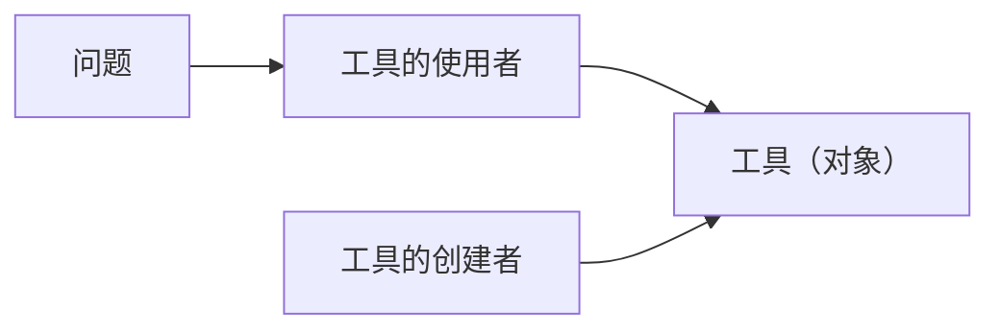

## 1、从面向过程到面向对象
**抽象的过程**：
计算机的工作是建立在抽象的基础上的，如机器语言和汇编语言是对机器硬件的抽象；高级语言是对汇编语言和机器语言的抽象。而现有抽象的问题，要求程序员按计算机的结构去思考，而不是按要解决的问题的结构去思考（即人类的思考方式）。当程序员要解决一个问题时，必须要在机器模型和实际要解决的问题模型之间建立联系。而计算机的结构本质上还是为了支持计算，当要解决一些非计算问题时，这个联系的建立是很困难的。
**面向对象的程序设计**：

## 2、类的定义
**类定义的一般格式**:
```cpp
class 类名 {
    private: //这行可写可不写
	    私有数据成员和成员函数
    public:
	    公有数据成员和成员函数
};
```
私有成员 (private)：只能由类的成员函数调用;私有成员被封装在一个类中，外界是看不见的
公有成员 (public)：外界可以调用的信息，是类对外的接口;
```cpp
```cpp
class IntArray {
private:
    int low;
    int high;
    int *storage;
    
public:
    bool initialize(int lh, int rh);
    bool insert(int index, int value);
    bool fetch(int index, int &value);
    void cleanup();
};
```

**类定义的说明**：
在类的定义中，成员可以被说明为private、public或protected。 private和public的出现次序可以是任意的，也可以反复出现多次。数据成员一般说明为private，需要被使用者调用的函数说明为public。不要为了方便从外部访问而将数据成员说明为public，这会破坏封装。与库一样，类的定义被放在一个头文件中，类的实现放在一个源文件中。也可以将成员函数的定义直接写在类定义中，这些函数被默认为内联函数。在本课程的作业中，请大家把类的定义和函数的定义都写在main.cpp里。

**类定义的实例**：试定义一个有理数类，该类能提供有理数的加和乘运算。要求保存的有理数是最简形式。如2/6应记录为1/3。
设计属性和对属性的操作。属性（有理数）：有理数的属性包含两个整数，即两个int数据成员。对属性的操作：创建函数（设置有理数的分子和分母）；加函数；乘函数；输出函数；化简函数。
访问权限设计。数据成员是私有的；化简函数是内部调用的函数，与使用者无关，因此也是私有的；其他函数都需要从外部调用，因此都是公有的。
```cpp
######Rational.h######

#ifndef _RATIONAL_H
#define _RATIONAL_H
#include <iostream>
using namespace std;

class Rational {
private:
    int num; // 分子
    int den; // 分母
    void ReductFraction(); // 将有理数化简成最简形式
    
public:
    void create(int n, int d) { num = n; den = d; }
    void add(const Rational &r1, const Rational &r2);
    void multi(const Rational &r1, const Rational &r2);
    void display() { cout << num << '/' << den; }
};

#endif


######Rational.cpp######

#include "Rational.h"

// add函数将r1和r2相加，结果留在当前对象
void Rational::add(const Rational &r1, const Rational &r2) {
    num = r1.num * r2.den + r2.num * r1.den;
    den = r1.den * r2.den;
    ReductFraction(); // 化简
}

// multi函数将r1和r2相乘，结果存于当前对象
void Rational::multi(const Rational &r1, const Rational &r2) {
    num = r1.num * r2.num;
    den = r1.den * r2.den;
    ReductFraction();
}

// ReductFraction实现有理数的化简（分子分母除以最大公约数）
void Rational::ReductFraction() {
    int tmp = (num > den) ? den : num;
    for (; tmp > 1; --tmp)
        if (num % tmp == 0 && den % tmp == 0)
            { num /= tmp; den /= tmp; break; }
}

```


## 3、对象的使用

**类与对象：**
类与对象的关系等同于类型与变量的关系
**对象定义方法：**	
直接在程序中定义某个类的对象（存储类别  类名  对象列表；）。如定义两个IntArray类的对象arr1和arr2，可写成：`IntArray arr1, arr2;`
用动态内存申请的方法申请一个动态对象。如：
```cpp
  Rational *rp;
  rp = new Rational; 或 rp = new Rational[20];
  delete rp; 或 delete [] rp;
```

**对象的使用**：
使用对象主要包括访问其数据成员和调用其成员函数。
```cpp
//对象名.数据成员名    或    对象指针->数据成员名  
  arr1.storage  或  rp->num
//对象名.成员函数名（实参表）    或    对象指针->成员函数名（实参表）  
  arr1.insert() 或  rp->add()
```
一般情况下，某个类之外的函数不能使用这个类中的私有成员。

**对象的赋值：**
同类型的对象之间可以互相赋值，如两个有理数类的对象 r1 和 r2，可以执行  `r1 = r2;`
当一个对象赋值给另一个对象时，所有的数据成员都会对应拷贝。上述赋值相当于执行 :
```cpp
  r1.num = r2.num
  r1.den = r2.den
```


**this指针**:
当定义一个对象时，系统会为对象分配空间，用于存储对象的数据成员。而类中的成员函数对该类的所有成员只有一份拷贝。那么对于类的成员函数，它如何知道要对哪个对象进行操作呢？ 每个成员函数都有一个隐藏的指向本类型的指针形象this，它指向当前对象（即当前调用成员函数的对象）。如对成员函数:
```cpp
    void create(int n, int d) { num = n; den = d; }
```
经过编译后，实际函数为  
 ```cpp
	void create(int n, int d) { this->num = n; this->den = d;}
```
通常，在写成员函数时应该省略this，编译器会自动加上它们。如果在成员函数中要把对象作为整体来访问时，必须显式地使用this指针。这种情况常出现在函数中返回一个对调用函数的对象的间接引用，即 `return *this;`

## 4、对象构造与析构

某些类的对象，必须在对它进行了初始化以后才能使用。对于某些类的对象在消亡前，往往也需要执行一些操作，做一些善后的处理。初始化和扫尾的工作给类的使用者带来了额外的负担，使他们觉得类和内置类型还是不一样（比如IntArray和int数组）。类的使用者希望类的对象就和内置类型的变量一样，一旦定义了，就能直接使用；用完了，由系统自动回收。

**构造函数与析构函数**：
构造函数和析构函数是特殊的成员函数。构造函数：为对象分配空间，进行初始化。析构函数：执行与构造函数相反的操作，通常执行一些清理工作，如释放分配给对象的空间等。

**构造函数的特点**：
构造函数的名字必须与类名相同。构造函数可以有任意类型的参数，也可以不带参数。构造函数没有返回类型（不是void而是没有）。定义对象时，系统会自动调用构造函数。如果没有给类定义构造函数，编译器会自动生成一个缺省的构造函数，它没有参数，只为对象开辟存储空间，空间中的内容为随机数。只要给类定义了构造函数，编译器就不会再自动生成构造函数。
```cpp
#include <iostream>
#include <cmath>
using namespace std;

class complex { // 定义一个名为complex的类
private: 
    double real, imag;
public: 
    complex(double r, double i) { real=r; imag=i; }
    double abscomplex() { // 返回该复数的模
        return sqrt(real*real + imag*imag);
    }
};
```

**构造函数的使用:**
有了构造函数后，对象定义的一般形式为：
   ```cpp
   类名 对象名（实际参数表）； // 直接初始化
   ```
其中，实际参数表必须和该类的某一个构造函数的形式参数表相对应。如果这个类有一个构造函数是没有参数的，那么还可以用：
   ```cpp
   类名 对象名；
   ```
不带参数的构造函数称为默认的构造函数。因此，默认的构造函数不一定是编译器自动生成的。
```cpp
int main() {
    complex a(1.2, 2.2); // 在定义对象时给构造函数传递参数
    cout << a.abscomplex() << endl;
    return 0;
}

// 如果只定义了带参数的构造函数，
// 那么定义对象时就要加上实际参数表，切勿遗漏。
```
以下是缺省参数的构造函数：
```cpp
class complex {
private: 
    double real, imag;
public: 
    complex(double r = 0.0, double i = 0.0) {
        real = r; 
        imag = i;
    }
    // 其他成员函数...
};

int main() {
    complex a;            // 全部用缺省值
    complex b(1.1);       // 只传递一个参数，第二个用缺省值
    complex c(1.1, 2.2);  // 传递两个参数，不用缺省值
    // ...
    return 0;
}
```

**重载构造函数**:
当一个类有多个构造函数时，它们是重载函数。例：
```cpp
//试设计一个时间转换器，用户可输入秒、分秒或时分秒，输出相应的秒数。
class timer {
    int second;
public:
    timer(int t) { second = t; }
    timer(int min, int sec) { second = 60 * min + sec; }
    timer(int h, int min, int sec) { second = sec + 60 * min + 3600 * h; }
    int gettime() { return second; }
};

int main() {
    timer a(20), b(1, 20), c(1, 1, 10);
    cout << a.gettime() << endl;
    cout << b.gettime() << endl;
    cout << c.gettime() << endl;
    return 0;
}
```

**动态对象的初始化**:
动态变量的初始化是在类型后面用一个圆括号指出它的实际参数表：
 ```cpp
 p = new int(5); 
 ```
类似的，如果要为一个动态的IntArray对象指定其数组下标范围为20到30，可用下列语句：
```cpp
p = new IntArray(20, 30); 
```
括号中的实际参数要和构造函数的形式参数表相对应。

**初始化列表方法:**
构造函数还有一个与普通函数不同的地方，就是可以包含一个构造函数初始化列表。构造函数初始化列表位于函数头和函数体之间。它以一个冒号开头，接着是一个以逗号分隔的数据成员列表。每个数据成员的后面跟着一个放在圆括号中的对应于该数据成员的初始化值。这个初始化值通常是构造函数的形式参数。如`IntArray`的构造函数可写为:
  ```cpp
  IntArray::IntArray(int lh, int rh) : low(lh), high(rh)
  { storage = new int[high - low + 1]; }
  ```
必须使用初始化列表的情况：当数据成员不是普通的内置类型，而是某一个类的对象且该类没有默认的构造函数，则必须在构造函数的初始化列表中为它赋值，例如数据成员x是IntArray类型，其构造函数需要2个实参。又或者，类包含了一个常量的数据成员，常量只能在定义时对它初始化，而不能对它赋值。因此也必须放在初始化列表中，例如数据成员y是const int类型，则无法对y赋值。
可以进行类内初始化，但以构造函数的初始化优先级更高：
```cpp
class point{
	int x=0,y=0;
public:
	...
};


//情况一例子
class Member {
public:
    Member(int value);      // 只有带参数的构造函数
    // 没有默认构造函数 Member()
};

class Container {
private:
    Member mem;             // 成员对象
    int data;
    
public:
    // 错误！没有在初始化列表中初始化mem
    Container(int d) {
        data = d;           // 赋值，不是初始化
        // 错误：mem已经尝试默认构造，但Member没有默认构造
    }
    
    // 正确！在初始化列表中初始化mem
    Container(int m, int d) : mem(m), data(d) {
        // mem已在初始化列表中构造
    }
};
```

**拷贝构造函数**:
在创建一个对象时，可以用一个同类的对象对其初始化。这时需要调用一个特殊的构造函数，称为拷贝构造函数。拷贝构造函数以一个同类对象的引用作为参数，它的原型为：
```cpp
类名(const 类名&);
```
程序员可以根据自己的需要定义拷贝构造函数。如果程序员没有定义拷贝构造函数，系统会定义一个缺省的拷贝构造函数。该函数将已存在的对象原式原样地复制给新对象。
```cpp
//格式：
classname(const classname &ob) {.....}
//例：
class points{
	int x, y; public:
	point(int a, int b) { x = a; y = b; }
	point(const point &p){x =2*p.x; y=2*p.y;}//拷贝构造函数
};
```

**需要自定义拷贝构造函数的情况：**
一般情况下，默认的拷贝构造函数足以满足要求，即原样复制。但有时默认的拷贝构造函数却不能胜任。例如，我们希望对IntArray类增加一个功能，能够定义一个和已有数组完全一样的数组。如果正在构造的对象为arr1，作为参数的已有对象是arr2，调用默认的拷贝构造函数相当于执行下列操作：  
```cpp
arr1.low = arr2.low;  
arr1.high = arr2.high;  
arr1.storage = arr2.storage;
```
前两个操作没有问题，但storage是一个指针，第三个操作意味着使arr1的storage指针和arr2的storage指针指向同一块空间。使用同一块空间的问题:
一个对象的修改将会影响另一个对象。
```cpp
arr1.insert （13, 5）；
arr2.fetch (13, value); cout < value; // 输出5
```
如果两个对象的作用域不同，当一个对象析构时，另一个对象也将丧失它的空间。例如，arr1的析构会执行 `delete storage；`释放`arr1.storage`指向的动态内存空间，于是`arr2.storage`丧失了指向的动态内存空间。

**拷贝构造函数的应用**：
对象定义时；把对象作为参数传给函数时；把对象作为返回值时（后面两个都是指值传递）。

拷贝构造函数用于对象构造时有两种用法：直接初始化和拷贝初始化。
```cpp
//直接初始化且圆括号中的实参为同类对象，  
    IntArray arr2 (arr1) ;
//拷贝初始化是用“=”符号进行初始化，  
    IntArray arr = IntArray (20, 30) ;  
    IntArray arr2 = arr1;
```
例，
```cpp
class point{
	int x, y; 
public:
	point(int a, int b) {x=a; y=b;}
	point(const point &p) {x=2*p.x; y=2*p.y;}
	void print() {cout<<x<<" "<<y<<endl;}
};

int main () {
	point p1(10, 20), p2(p1), p3 = p1, p4(1, 2);
	p1.print(); p2.print(); p3.print(); p4.print();
	p4 = p1; p4.print();
	return 0;
}

//输出：
	10 20
	20 40
	20 40
	1 2
	10 20
```
把对象作为参数传给函数时,
```cpp
//如有函数： 
void f(IntArray a);
//函数调用：f(arr);
//将创建一个形式参数对象a，并调用拷贝构造函数，用实参对象arr来初始化形参对象a。相当于：       
IntArray a = arr;          
```
把对象作为返回值时,
```cpp
//如有函数：
IntArray f() {
	IntArray a;
	return a;
}

//函数调用：
arr = f();//赋值运算，不构造

//当执行到return语句时，会创建一个IntArray类的临时对象，并调用拷贝构造函数，用对象a来初始化该临时对象，并将其作为主调函数获得的返回值。这个地方a是左值，但函数的返回值是右值


//移动构造函数示例：
class MyClass {
public:
    // 移动构造函数
    MyClass(MyClass&& other) noexcept {
        // 从other"窃取"资源
        // 将other置于有效但可析构的状态
    }
};
```

**移动构造函数**：
```cpp
//如有函数：
IntArray f() {
	IntArray a;
	return a;
}

//函数调用：
IntArray arr = f();//定义初始化，要构造

//用临时对象来初始化同类对象arr，此时不调用拷贝构造函数，而调用移动构造函数，使arr直接获得临时对象的值。注意，函数的返回值都是右值。
```


**析构函数**：
在撤销对象时，由编译系统自动调用析构函数。不要自己写行代码来调用析构函数！
析构函数与构造函数名字相同，但它前面必须加一个波浪号“~”。析构函数没有参数，没有返回值，也不能重载。若定义类时没有定义析构函数，编译系统会自动生成一个缺省的空析构函数（什么也不做）。
```cpp
class IntArray {
	int low; int high;
	int *storage;
public:
	IntArray(int Ih, int rh): low(Ih), high(rh)
	{ storage = new int [high - low + 1]; }
	bool insert(int index, int value); bool fetchint index, int &value);
	~IntArray() { delete [] storage; }
};
```


## 5、常量对象与常量成员函数

**常量对象的定义**：
```cpp
const 类名 对象名  (参数表);
//例如：
const IntArray arr1 (20, 30);
```
常量对象不能被赋值，只能初始化，而且一定要初始化。

**常量成员函数**:
如何保证常量对象的数据成员不被修改？数据成员一般都由成员函数修改。当定义了一个常量对象后，为保证成员函数不修改数据成员，C++规定：对const对象只能调用const成员函数。任何不修改数据成员的函数都应该声明为const类型。如果在编写const成员函数时，不慎修改了数据成员，或者调用了其他非const成员函数，编译器将指出错误，这无疑会提高程序的健壮性(robustness)。
```cpp
//类A的定义方式一
class A {
	int x; 
public:
	A (int i) {x = i; }
	int getx () const { return x; }
} ;


//类A的定义方式二
class A {
	int x;
public:
	A(int i) {x=i;}
	int getx const;
};

//const成员函数的定义
int A::getx const{
	return x;
}
```

## 6、常量数据成员
const数据成员只在某个对象生存期内是常量，而对于整个类而言却是可变的。同一类的不同对象其const数据成员的值可以不同。常量成员的声明，就是在该成员声明前加上const。如：  
```cpp
class abc {
	  const int x = 8;//常量数据成员也可以类内初始化
  ...
}
```


## 7、静态数据成员与静态成员函数

**静态数据成员**:
静态数据成员不属于对象的一部分，而是类的一部分。我们知道类的定义并不为数据成员分配空间，数据成员的空间是在定义对象时分配的。但静态数据成员属于类而不属于对象，因此定义对象时不为静态数据成员分配空间。构造函数的初始化列表和类内初始化都是在定义对象时执行初始化过程，因此静态数据成员的初始化也不能通过这两种方式进行。
```cpp
class SavingAccount{
	static double rate;
};
```

**静态数据成员的定义**:
为静态数据成员分配空间称为静态数据成员的定义。 静态数据成员的定义一般出现在类的实现文件中。如在SavingAccount类的实现文件中，必须要有如下的定义：
```cpp
double SavingAccount::rate = 0.05;
//注意此处没有static,该定义为静态数据成员rate分配了空间，并给它赋了一个初值0.05
//如果没有这个定义，连接器会报告一个错误 （ld returned 1 exit status）
```

**静态成员的使用**:
可以通过作用域操作符从类直接调用。如： 
```cpp
SavingAccount::rate
```
但从每个对象的角度来看，静态数据成员似乎又是对象的一部分，因此又可以从对象引用它。如有个SavingAccount类的对象obj，则可以用：
```cpp
obj.rate
```
由于静态数据成员是整个类共享的，因此不管用哪种调用方式，得到的值都是相同的。

**静态成员函数**:
成员函数也可以是静态的。静态的成员函数是为类的全体对象服务，而不是为某个类的特定对象服务。静态成员函数不需要借助任何对象就可以被调用，编译器也不会为它暗加一个this指针。因此，静态成员函数无法通过当前对象来处理其非静态成员变量。静态成员函数的声明只需要在类定义中的函数原型前加上保留词static

**静态成员函数的用途**:
定义静态成员函数的主要目的是访问静态的数据成员。如在SavingAccount类中，当利率发生变化时，必须修改静态数据成员rate的值。为此可以设置一个静态的成员函数：
```cpp
static void SetRate (double newRate) ( rate = newRate; }
```

**静态成员函数使用说明**:
静态成员函数可定义为内联的，也可在类外定义，在类外定义时，不用加static。
静态成员函数可以通过类作用域限定符或通过对象访问：
```cpp
类名：：静态成员函数名()

//或  

对象名.静态成员函数名()
```
以上两点均与静态数据成员的定义和使用相似，下面提供一个静态成员函数定义实例：
```cpp
class goods {
	int weight;
	static int total_weight;
public:
	goods(int w);
	~goods();
	int getweight();
	static int totalweight);
};

goods::goods (int w) {
	weight=w;
	total_weight+=w;
}

goods::~goods) {
	total_weight-=weight;
}

int goods::getweight() {
	return weight;
}

int goods::totalweight() {
	return total_weight;
}
```


**静态的常量数据成员**：整个类的所有对象的共享常量，静态的常量数据成员的声明：
```cpp
static const 类型 数据成员名= 常量表达式；
```
注意const数据成员和static const数据成员的区别，前者是属于各个对象的常量，后者是整个类共享的常量。


## 8、友元

我们知道，类的私有成员只能通过它的成员函数来访问。友元是一扇通往私有成员的后门。友元可以是一个一般函数（友元函数），也可以是另一个类的成员函数（友元成员），还可以是整个类（友元类）。注意，良好的程序设计习惯是将所有的友元关系声明写在前面

**友元特点**：
友元关系是授予的而不是索取的。也就是说，如果函数f要成为类A的友元，类A必须显式声明函数f是他的友元，而不是函数f自称是类A的友元。
友元关系不是对称关系，如果类A声明了类B是它的友元，并不意味着类A也是类B的友元。
友元关系不是传递关系。如果类A是类B的友元，类B是类C的友元，并不意味着类A是类C的友元。


**友元函数**：
用关键词friend说明友元函数。可声明在public部分，也可声明在private部分。
```cpp
fiend void f();
```


**友元成员函数**：
是其他某个类的成员函数，可以访问friend声明语句所在类的私有成员
```cpp
//格式：
friend 函数返回类型 类名标识符::函数名(参数列表);
```
类A的成员函数作为类B的友元函数时，必须先声明类B，再定义类A，再定义类B

**友元类**:
整个类作为另一个类的友元。
当A类被说明为类B的友元时，类A的所有函数都是类B的友元函数,声明方法：
```cpp

class Y{......};

class X{
	......
	
	friend class Y;
	
	......
};
```

