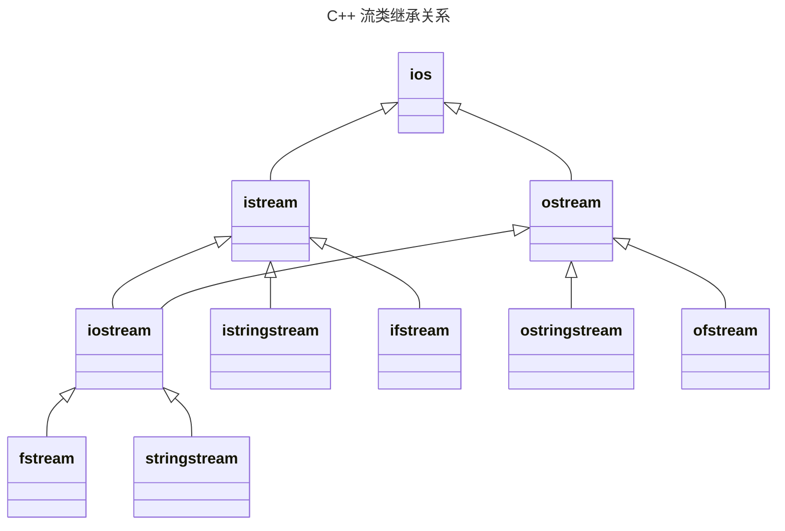

## 一、输入输出与流

输入输出是指程序与外部设备交换信息。
C++把输入输出看成是一个数据流：输出流是内存流向外围设备；输入流是外围设备流向内存。在C++中，输入输出不是语言所定义的部分，而是由标准库提供。C++的输入输出分为，基于控制台的I/O（i`ostream`库）,基于文件的I/O（`fstream`库）,基于字符串的I/O（`ostream`库）

**流的概念及用途**：
 I/O操作是以对数据类型敏感的方式执行的。C++的I/O操作是以字节流的形式实现的。流实际上就是字节序列。C++提供了低级和高级I/O功能。低级I/O功能通常只在设备和内存之间传输一些字节。高级I/O功能把若干个字节组合成有意义的单位，如整数、浮点数、字符、字符串以及用户自定义类型的数据。 C++提供了无格式I/O和格式化I/O两种操作。无格式I/O传输速度快，但使用起来较为麻烦。格式化I/O按不同的类型对数据进行处理，但需要增加额外的处理时间，不适于处理大容量的数据传输。

**流与标准库：**
```
头文件iostream
	istream从流中读取
	ostream写到流中去
	iostream对流进行读写，从istream和ostream派生
头文件:fstream
	ifstream从文件中读取，由istream派生而来
	ofstream写到文件中去，由ostream派生而来
	fstream对流进行读写，由iostream派生而来
头文件：sstream
	istringstream从string对象中读取，由istream派生而来
	ostringstream写到string对象中去，由ostream派生而来
	stringstream对string对象进行读写，由iostream派生而来
```



**输入输出缓冲**：
C++的输入输出是基于缓冲实现的。每个I/O对象管理一个缓冲区，用于存储程序读写的数据。当用户在键盘上输入数据时，键盘输入的数据存储在输入缓冲区中。 当执行">>"操作时，从输入缓冲区中取数据存入变量。如果缓冲区中无数据，则等待从外围设备取数据放入缓冲区。当执行"<<"操作时，将数据放入输出缓冲区。如有下列语句：
```cpp
os << "please enter the value:"; //此处os为输出流对象
```
 系统将字符串常量存储在与输出流os关联的缓冲区中。

**输出缓冲区的刷新**:
取出缓冲区的内容后再将其清空的操作称为缓冲区的刷新。
例如，刷新cout的缓冲区时，从其中取出的内容将显示在控制台上。程序正常结束时，作为main函数返回工作的一部分，会刷新缓冲区。 当缓冲区已满时，在放入下一个值之前，会刷新缓冲区。 用标准库的操纵符（如行结束符endl）可显式地刷新缓冲区。这是 endl 和 '\n' 的又一个区别。 可将输出流与输入流关联起来。在这种情况下，在读输入流时，将刷新其关联的输出缓冲区。在标准库中，cout和cin被关联在一起，因此每个使用cin的输入操作都将刷新cout关联的缓冲区。

**输入输出运算的本质:**
执行输入运算，如`cin >> x`，不一定要此时在外部设备输入。它表示数据从输入缓冲区转移到某个变量的内存空间。当输入缓冲区中没有数据时，输入运算会等待新数据出现后再继续。执行输出运算，如 `cout << x` ，不会立刻输出到外部设备上。它表示数据从某个变量或常量的内存空间复制到输出缓冲区。当输出缓冲区刷新时，输出缓冲区中的数据转移到外部设备。

## 二、基于控制台的输入输出
**对象：**
 `cin` 是 `istream` 类的对象，它与标准输入设备（通常指键盘）连在一起。
`cout` 是 `ostream` 类的对象，它与标准输出设备（通常指显示设备）连在一起。
`cerr` 是 `ostream` 类的对象，它与标准错误输出设备连在一起，**无缓冲**。
`clog` 是 `ostream` 类的对象，它与标准错误输出设备连在一起，**有缓冲**。

**输出流**：
C++的 `ostream` 类提供了格式化输出和无格式输出的功能。
输出功能包括：用流插入运算符 `<<` 输出标准类型的数据；用成员函数 `put` 输出字符；成员函数 `write` 的无格式化输出；输出特定形式数值。

**指针输出的特例：**
如果输出的指针变量是一个指向字符的指针，C++并不输出该指针中保存的地址，而是输出该指针指向的字符串。
如果确实想输出这个指向字符的指针变量中保存的地址值，可以用强制类型转换，将它转换成 `void*` 类型。
```cpp
#include <iostream>
using namespace std;

int main() {
    char *ptr = "abcdef";
    cout << "ptr指向的内容为:  " << ptr << endl;
    cout << "ptr中保存的地址为:  " << (void*) ptr << endl;
    return 0;
}
```


**用成员函数put输出字符**:
`cout.put('A')`： 将字符A显示在屏幕上，并返回当前对象。
连续调用put函数：`cout.put('A').put('\n')`该语句在输出字符A后输出一个换行符。圆点运算符"."从左向右结合。
`cout.put(65)`：用ASCII码值表达式调用put函数，语句也输出字符A。

**write的无格式输出**
调用成员函数write可实现无格式输出。它有两个参数。第一个参数是一个字符指针，第二个参数是一个整型值。这个函数把一定量的字节从字符数组中输出。这些字节都是未经任何格式化的，仅仅是以原始数据形式输出。例如：
```cpp
char buffer[] = "HAPPY BIRTHDAY";
cout.write(buffer, 10); // 输出buffer的10个字节
cout.write("ABCDEFGHIJKLMNOPQRSTUVWXYZ", 10); // 显示字母表的前10个字母
```
 很少用于控制台的I/O，主要用于文件的I/O。

**输入流**：
stream类提供了格式化和无格式的输入功能。输入功能包括用流读取运算符>>执行标准类数据的输入，通过get和getline成员函数进行字符和字符串的输入，通过read成员函数进行无格式的输入，以及格式化的输入。

**流读取运算符>>**：
 输入流最常用的操作是流读取运算符。通常会跳过输入流中的空格符、制表符、换行符等空白字符。在读取成功时返回当前对象（如cin）的引用。当遇到输入流中的文件结束符（EOF）时，流读取运算符返回0（EOF在各个系统中有不同表示，Windows中可用`Ctrl+Z`从键盘输入控制台）。流读取运算符在读入EOF时返回0的特性使得它经常被用作为循环的判别条件，以避免选择特定的表示输入结束的值。实例:
```cpp
//统计某次考试的最高成绩，但事先不知道有多少个成绩。
//在输入结束时，用户会输入表示成绩输入完毕的文件结束符EOF，此时，while循环结构中的条件（cin>>grade）将变为0（即false）。
//EOF本身的值通常是-1，在不同系统中可能会不同。

#include <iostream>
using namespace std;
int main() {
    int grade, highestGrade = -1;
    cout << "Enter grade (enter end-of-file to end): ";
    while ( cin >> grade ) {
    if ( grade > highestGrade) highestGrade = grade;
    cout << "Enter grade (enter end-of-file to end): ";
    }
    cout << "\nnHighest grade is: "<< highestGrade << endl;
    return 0;
}
```
```
输出结果：
Enter grade (enter end-of-file to end): 67  
Enter grade (enter end-of-file to end): 87  
Enter grade (enter end of file to end): 73  
Enter grade (enter end-of-file to end): 95  
Enter grade (enter end-of-file to end): 34  
Enter grade (enter end-of-file to end): 99  
Entergrade (enter end-of-file to end): ^z  
Heightest grade is: 99
```

**get**:
get函数用于读入字符或字符串
get函数有三种格式：
	不带参数   ` istream::get() | ch = cin.get()`;
	带一个参数    `istream::get(char&) | cin.get (ch)`;
	带三个参数` istream::get(char[], int, char='\n') | cin.get (arr, 10)`
	
不带参数的get函数:不带参数的get函数从当前对象读入一个字符，包括空白字符以及表示文件结束的EOF，并将读入值作为函数的返回值。如下列语句：
  ```
  while ( (ch = cin.get()) != EOF ) cout<< ch;
  ```
将输入的字符输出在显示器上，直到输入EOF。

带一个参数的get函数: 带一个字符类型的引用参数，它将输入流中的下一字符（包括空白字符）存储在参数中，它的返回值是当前对象的引用。例如，下面的循环语句将输入一个字符串，存入字符数组ch，直到输入回车
```cpp
cin.get(ch[0]);

for (i = 0; ch[i] != '\n'; ++i) cin.get(ch[i+1]);

ch[i] = '\0';
```

带三个参数的get函数: 参数分别是接收字符的字符数组、字符数组的大小和分隔符（默认值为‘\n’）。该函数可以在读取比指定的最大字符数少一个字符后结束，也可以在遇到分隔符时结束。
为使字符数组（被程序用作缓冲区）中的输入字符串能够结束，空字符会被插入到字符数组中。函数不把分隔符放到字符数组中，但是分隔符仍然会保留在输入流中。

**`getline`**：略 

**使用read函数输入**：
调用成员函数read可实现无格式输入。它有两个参数。第一个参数是一个指向字符的指针，第二个参数是一个整型值。这个函数把一定量的字节从输入缓冲区读入字符数组，不管这些字节包含的是什么内容。
```cpp
char buffer[80];
cin.read(buffer, 10);  // 读入10个字节，放入buffer
```

直接读取原始字节，不做任何转换，包括空白字符、控制字符等。如果还没读到指定的字符数就遇到了EOF，则读操作结束。可用成员函数gcount统计实际输入的字符个数
```cpp
#include <iostream>
using namespace std;

int main() {
    char buffer[80];
    cout << "Enter a sentence:\n";
    cin.read(buffer, 20);                // 尝试读取20个字符
    cout << "一共输入了" << cin.gcount() << "个字符\n";
    cout << "\nThe sentence entered was:\n";
    cout.write(buffer, cin.gcount());    // 输出实际读取的字符
    cout << endl;
    return 0;
}
```
```
输入：
Using the read, write, and gcount member functions

输出：
Enter a sentence:
Using the read, write, and gcount member functions
一共输入了20个字符
The sentence entered was:
Using the read, write
```
注意，read函数不会自动在末尾添加空字符；gcount返回最近一次无格式输入操作读取的字符数

**格式化输入/输出**：
C++提供了大量的用于执行格式化输入/输出的流操纵算子和成员函数。
主要功能：
	整数流的基数：`dec`、`oct`、`hex`和`setbase`
	设置浮点数精度：`precision`、`setprecision`
	设置域宽：`setw`、`width`
	设置域填充字符：`fill`、`setfill`

设置整型数的基数：
基本操纵符：
	默认：十进制表示
	`hex`：将基数设为十六进制
	`oct`：将基数设为八进制  
	`dec`：将基数重新设为十进制
`setbase`流操纵符：
	参数值：16、10或8
	使用带参数的流操纵符需要包含头文件 `<iomanip>`
	注意：基数设置会一直保持，直到显式更改
```cpp
#include <iostream>
#include <iomanip>
using namespace std;

int main()
{
    int n;
    cout << "Enter an octal number: ";
    cin >> oct >> n;  // 以八进制格式输入
    cout << "octal " << oct << n << " in hexadecimal is:" << hex << n << '\n';
    cout << "hexdecimal " << n << " in decimal is:" << dec << n << '\n';
    cout << setbase(8) << "octal " << n <<" in octal is:" << n << endl;
    return 0;
}
```
```
Enter an octal number: 30
Octal 30 in hexadecimal is: 18
Hexadecimal 18 in decimal is: 24
Octal 30 in octal is: 30
```

设置浮点数精度:
方法
	流操纵符 `setprecision`
	成员函数 `precision()`
	影响所有后续输出的浮点数，直到下一次精度设置
```cpp
#include <iostream>
#include <iomanip>
using namespace std;

int main() {
    double x = 123.456789, y = 9876.54321;

    for (int i = 9; i > 0; --i) { 
        cout.precision(i); 
        cout << x << '\t' << y << endl; 
    }
    // 等价于:
    // for (int i = 9; i > 0; --i) 
    //     cout << setprecision(i) << x << '\t' << y << endl;

    return 0;
}
```
```
123.456789  9876.54321
123.45679  9876.5432
123.4568  9876.543
123.457  9876.54
123.46  9876.5
123.5  9877
123   9.88e+003
1.2e+002  9.9e+003
1e+002  1e+004
```

fixed模式设置小数点后位数
```cpp
#include <iostream>
#include <iomanip>
using namespace std;

int main() {
    double x = 123.456789, y = 9876.54321;

    cout << fixed << setprecision(2) << x << '\t' << y << endl;
    cout << fixed << setprecision(3) << x << '\t' << y << endl;
    // 加上fixed之后，setprecision的参数表示小数点后取几位

    return 0;
}
```

**设置域宽**:
基本概念:
	域宽：数据所占的字符个数
	设置方法：
		成员函数 `width()`
		流操纵符 `setw()`（需要包含 `<iomanip>`）
	特性：设置仅对下一次输入/输出有效，之后恢复默认
```cpp
//输出
int x = 123, y = 456;
cout << setw(5) << x << setw(5) << y << endl;
// 输出：  123  456
// 每个数值占5个位置，前面用空格填充（右对齐）
```
不同类型数据的对齐方式：数值右对齐，前面填充空格;字符串左对齐，后面填充空格
```cpp
//输入
char a[9], b[9];
cin >> setw(5) >> a >> setw(5) >> b;

// 输入：abcdefghi jklm
// 结果：a = "abcd"（包含'\0'），b = "efgh"
```
`setw(5)` 实际读取4个字符+1个'\0'，防止缓冲区溢出

`setw()` 仅影响下一次操作；填充字符默认是空格，可用 `setfill()` 修改；如果实际宽度大于域宽，按实际宽度输出

常用流操纵符汇总：

| 流操纵符 | 描述 |
|---------|------|
| `skipws` | 跳过输入流中的空白字符，使用 `noskipws` 复位 |
| `left` | 输出左对齐，必要时在右边填充字符 |
| `right` | 输出右对齐，必要时在左边填充字符 |
| `showbase` | 在数字前输出基数（0开头表示八进制，0x/0X表示十六进制） |
| `uppercase` | 十六进制数使用大写字母，科学计数法使用大写字母E |
| `showpos` | 在正数前显示加号 (+) |
| `scientific` | 以科学计数法输出浮点数 |
| `fixed` | 以定点小数形式输出浮点数 |
| `setfill` | 设置填充字符，有一个字符型参数 |

## 5. 用户自定义的流操纵算子

### 自定义需求
当标准库提供的流操纵符不满足需求时，可以定义自己的流操纵符

### 定义格式
```cpp
ostream &操纵符名(ostream &os) {
    // 需要执行的操作
    return os;
}
```

### 示例：自定义笑脸操纵符
```cpp
#include <iostream>
using namespace std;

// 自定义流操纵符
ostream &smile(ostream &os) { 
    return os << "^ _ ^"; 
}

int main() {
    char a = 'q', b = 'p';
    cout << a << smile << b << endl;  // 输出：q^ _ ^p
    return 0;
}
```

### 自定义操纵符的特点
1. **命名自由**：符合C++标识符规范即可
2. **使用方便**：与标准操纵符用法相同
3. **功能灵活**：可以组合多个格式化操作
4. **提高可读性**：使代码更易理解

### 自定义操纵符的典型用途
1. 特定领域的格式化需求
2. 重复使用的复杂格式组合
3. 提高代码可读性的辅助格式化
4. 特殊符号或文本的便捷输出