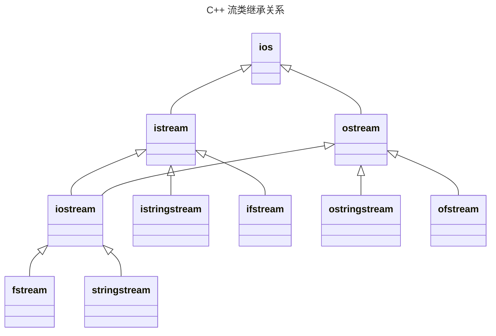

## 一、输入输出与流

输入输出是指程序与外部设备交换信息。
C++把输入输出看成是一个数据流：输出流是内存流向外围设备；输入流是外围设备流向内存。在C++中，输入输出不是语言所定义的部分，而是由标准库提供。C++的输入输出分为，基于控制台的I/O（i`ostream`库）,基于文件的I/O（`fstream`库）,基于字符串的I/O（`ostream`库）

**流的概念及用途**：
 I/O操作是以对数据类型敏感的方式执行的。C++的I/O操作是以字节流的形式实现的。流实际上就是字节序列。C++提供了低级和高级I/O功能。低级I/O功能通常只在设备和内存之间传输一些字节。高级I/O功能把若干个字节组合成有意义的单位，如整数、浮点数、字符、字符串以及用户自定义类型的数据。 C++提供了无格式I/O和格式化I/O两种操作。无格式I/O传输速度快，但使用起来较为麻烦。格式化I/O按不同的类型对数据进行处理，但需要增加额外的处理时间，不适于处理大容量的数据传输。

**流与标准库：**
```
头文件iostream
	istream从流中读取
	ostream写到流中去
	iostream对流进行读写，从istream和ostream派生
头文件:fstream
	ifstream从文件中读取，由istream派生而来
	ofstream写到文件中去，由ostream派生而来
	fstream对流进行读写，由iostream派生而来
头文件：sstream
	istringstream从string对象中读取，由istream派生而来
	ostringstream写到string对象中去，由ostream派生而来
	stringstream对string对象进行读写，由iostream派生而来
```



**输入输出缓冲**：
C++的输入输出是基于缓冲实现的。每个I/O对象管理一个缓冲区，用于存储程序读写的数据。当用户在键盘上输入数据时，键盘输入的数据存储在输入缓冲区中。 当执行">>"操作时，从输入缓冲区中取数据存入变量。如果缓冲区中无数据，则等待从外围设备取数据放入缓冲区。当执行"<<"操作时，将数据放入输出缓冲区。如有下列语句：
```cpp
os << "please enter the value:"; //此处os为输出流对象
```
 系统将字符串常量存储在与输出流os关联的缓冲区中。

**输出缓冲区的刷新**:
取出缓冲区的内容后再将其清空的操作称为缓冲区的刷新。
例如，刷新cout的缓冲区时，从其中取出的内容将显示在控制台上。程序正常结束时，作为main函数返回工作的一部分，会刷新缓冲区。 当缓冲区已满时，在放入下一个值之前，会刷新缓冲区。 用标准库的操纵符（如行结束符endl）可显式地刷新缓冲区。这是 endl 和 '\n' 的又一个区别。 可将输出流与输入流关联起来。在这种情况下，在读输入流时，将刷新其关联的输出缓冲区。在标准库中，cout和cin被关联在一起，因此每个使用cin的输入操作都将刷新cout关联的缓冲区。

**输入输出运算的本质:**
执行输入运算，如`cin >> x`，不一定要此时在外部设备输入。它表示数据从输入缓冲区转移到某个变量的内存空间。当输入缓冲区中没有数据时，输入运算会等待新数据出现后再继续。执行输出运算，如 `cout << x` ，不会立刻输出到外部设备上。它表示数据从某个变量或常量的内存空间复制到输出缓冲区。当输出缓冲区刷新时，输出缓冲区中的数据转移到外部设备。

## 二、基于控制台的输入输出
**对象：**
 `cin` 是 `istream` 类的对象，它与标准输入设备（通常指键盘）连在一起。
`cout` 是 `ostream` 类的对象，它与标准输出设备（通常指显示设备）连在一起。
`cerr` 是 `ostream` 类的对象，它与标准错误输出设备连在一起，**无缓冲**。
`clog` 是 `ostream` 类的对象，它与标准错误输出设备连在一起，**有缓冲**。

**输出流**：
C++的 `ostream` 类提供了格式化输出和无格式输出的功能。
输出功能包括：用流插入运算符 `<<` 输出标准类型的数据；用成员函数 `put` 输出字符；成员函数 `write` 的无格式化输出；输出特定形式数值。

**指针输出的特例：**
如果输出的指针变量是一个指向字符的指针，C++并不输出该指针中保存的地址，而是输出该指针指向的字符串。
如果确实想输出这个指向字符的指针变量中保存的地址值，可以用强制类型转换，将它转换成 `void*` 类型。
```cpp
#include <iostream>
using namespace std;

int main() {
    char *ptr = "abcdef";
    cout << "ptr指向的内容为:  " << ptr << endl;
    cout << "ptr中保存的地址为:  " << (void*) ptr << endl;
    return 0;
}
```


**用成员函数put输出字符**:
`cout.put('A')`： 将字符A显示在屏幕上，并返回当前对象。
连续调用put函数：`cout.put('A').put('\n')`该语句在输出字符A后输出一个换行符。圆点运算符"."从左向右结合。
`cout.put(65)`：用ASCII码值表达式调用put函数，语句也输出字符A。

**write的无格式输出**
调用成员函数write可实现无格式输出。它有两个参数。第一个参数是一个字符指针，第二个参数是一个整型值。这个函数把一定量的字节从字符数组中输出。这些字节都是未经任何格式化的，仅仅是以原始数据形式输出。例如：
```cpp
char buffer[] = "HAPPY BIRTHDAY";
cout.write(buffer, 10); // 输出buffer的10个字节
cout.write("ABCDEFGHIJKLMNOPQRSTUVWXYZ", 10); // 显示字母表的前10个字母
```
 很少用于控制台的I/O，主要用于文件的I/O。

**输入流**：
stream类提供了格式化和无格式的输入功能。输入功能包括用流读取运算符>>执行标准类数据的输入，通过get和getline成员函数进行字符和字符串的输入，通过read成员函数进行无格式的输入，以及格式化的输入。

**流读取运算符>>**：
 输入流最常用的操作是流读取运算符。通常会跳过输入流中的空格符、制表符、换行符等空白字符。在读取成功时返回当前对象（如cin）的引用。当遇到输入流中的文件结束符（EOF）时，流读取运算符返回0（EOF在各个系统中有不同表示，Windows中可用`Ctrl+Z`从键盘输入控制台）。流读取运算符在读入EOF时返回0的特性使得它经常被用作为循环的判别条件，以避免选择特定的表示输入结束的值。实例:
```cpp
//统计某次考试的最高成绩，但事先不知道有多少个成绩。
//在输入结束时，用户会输入表示成绩输入完毕的文件结束符EOF，此时，while循环结构中的条件（cin>>grade）将变为0（即false）。
//EOF本身的值通常是-1，在不同系统中可能会不同。

#include <iostream>
using namespace std;
int main() {
    int grade, highestGrade = -1;
    cout << "Enter grade (enter end-of-file to end): ";
    while ( cin >> grade ) {
    if ( grade > highestGrade) highestGrade = grade;
    cout << "Enter grade (enter end-of-file to end): ";
    }
    cout << "\nnHighest grade is: "<< highestGrade << endl;
    return 0;
}
```
```
输出结果：
Enter grade (enter end-of-file to end): 67  
Enter grade (enter end-of-file to end): 87  
Enter grade (enter end of file to end): 73  
Enter grade (enter end-of-file to end): 95  
Enter grade (enter end-of-file to end): 34  
Enter grade (enter end-of-file to end): 99  
Entergrade (enter end-of-file to end): ^z  
Heightest grade is: 99
```

**get**:
get函数用于读入字符或字符串
get函数有三种格式：
	不带参数   ` istream::get() | ch = cin.get()`;
	带一个参数    `istream::get(char&) | cin.get (ch)`;
	带三个参数` istream::get(char[], int, char='\n') | cin.get (arr, 10)`
	
不带参数的get函数:不带参数的get函数从当前对象读入一个字符，包括空白字符以及表示文件结束的EOF，并将读入值作为函数的返回值。如下列语句：
  ```
  while ( (ch = cin.get()) != EOF ) cout<< ch;
  ```
将输入的字符输出在显示器上，直到输入EOF。

带一个参数的get函数: 带一个字符类型的引用参数，它将输入流中的下一字符（包括空白字符）存储在参数中，它的返回值是当前对象的引用。例如，下面的循环语句将输入一个字符串，存入字符数组ch，直到输入回车
```cpp
cin.get(ch[0]);

for (i = 0; ch[i] != '\n'; ++i) cin.get(ch[i+1]);

ch[i] = '\0';
```

带三个参数的get函数: 参数分别是接收字符的字符数组、字符数组的大小和分隔符（默认值为‘\n’）。该函数可以在读取比指定的最大字符数少一个字符后结束，也可以在遇到分隔符时结束。
为使字符数组（被程序用作缓冲区）中的输入字符串能够结束，空字符会被插入到字符数组中。函数不把分隔符放到字符数组中，但是分隔符仍然会保留在输入流中。

**`getline`**：略 

**使用read函数输入**：
调用成员函数read可实现无格式输入。它有两个参数。第一个参数是一个指向字符的指针，第二个参数是一个整型值。这个函数把一定量的字节从输入缓冲区读入字符数组，不管这些字节包含的是什么内容。
```cpp
char buffer[80];
cin.read(buffer, 10);  // 读入10个字节，放入buffer
```

直接读取原始字节，不做任何转换，包括空白字符、控制字符等。如果还没读到指定的字符数就遇到了EOF，则读操作结束。可用成员函数gcount统计实际输入的字符个数
```cpp
#include <iostream>
using namespace std;

int main() {
    char buffer[80];
    cout << "Enter a sentence:\n";
    cin.read(buffer, 20);                // 尝试读取20个字符
    cout << "一共输入了" << cin.gcount() << "个字符\n";
    cout << "\nThe sentence entered was:\n";
    cout.write(buffer, cin.gcount());    // 输出实际读取的字符
    cout << endl;
    return 0;
}
```
```
输入：
Using the read, write, and gcount member functions

输出：
Enter a sentence:
Using the read, write, and gcount member functions
一共输入了20个字符
The sentence entered was:
Using the read, write
```
注意，read函数不会自动在末尾添加空字符；gcount返回最近一次无格式输入操作读取的字符数

**格式化输入/输出**：
C++提供了大量的用于执行格式化输入/输出的流操纵算子和成员函数。
主要功能：
	整数流的基数：`dec`、`oct`、`hex`和`setbase`
	设置浮点数精度：`precision`、`setprecision`
	设置域宽：`setw`、`width`
	设置域填充字符：`fill`、`setfill`

设置整型数的基数：
基本操纵符：
	默认：十进制表示
	`hex`：将基数设为十六进制
	`oct`：将基数设为八进制  
	`dec`：将基数重新设为十进制
`setbase`流操纵符：
	参数值：16、10或8
	使用带参数的流操纵符需要包含头文件 `<iomanip>`
	注意：基数设置会一直保持，直到显式更改
```cpp
#include <iostream>
#include <iomanip>
using namespace std;

int main()
{
    int n;
    cout << "Enter an octal number: ";
    cin >> oct >> n;  // 以八进制格式输入
    cout << "octal " << oct << n << " in hexadecimal is:" << hex << n << '\n';
    cout << "hexdecimal " << n << " in decimal is:" << dec << n << '\n';
    cout << setbase(8) << "octal " << n <<" in octal is:" << n << endl;
    return 0;
}
```
```
Enter an octal number: 30
Octal 30 in hexadecimal is: 18
Hexadecimal 18 in decimal is: 24
Octal 30 in octal is: 30
```

设置浮点数精度:
方法
	流操纵符 `setprecision`
	成员函数 `precision()`
	影响所有后续输出的浮点数，直到下一次精度设置
```cpp
#include <iostream>
#include <iomanip>
using namespace std;

int main() {
    double x = 123.456789, y = 9876.54321;

    for (int i = 9; i > 0; --i) { 
        cout.precision(i); 
        cout << x << '\t' << y << endl; 
    }
    // 等价于:
    // for (int i = 9; i > 0; --i) 
    //     cout << setprecision(i) << x << '\t' << y << endl;

    return 0;
}
```
```
123.456789  9876.54321
123.45679  9876.5432
123.4568  9876.543
123.457  9876.54
123.46  9876.5
123.5  9877
123   9.88e+003
1.2e+002  9.9e+003
1e+002  1e+004
```

fixed模式设置小数点后位数
```cpp
#include <iostream>
#include <iomanip>
using namespace std;

int main() {
    double x = 123.456789, y = 9876.54321;

    cout << fixed << setprecision(2) << x << '\t' << y << endl;
    cout << fixed << setprecision(3) << x << '\t' << y << endl;
    // 加上fixed之后，setprecision的参数表示小数点后取几位

    return 0;
}
```

**设置域宽**:
基本概念:
	域宽：数据所占的字符个数
	设置方法：
		成员函数 `width()`
		流操纵符 `setw()`（需要包含 `<iomanip>`）
	特性：设置仅对下一次输入/输出有效，之后恢复默认
```cpp
//输出
int x = 123, y = 456;
cout << setw(5) << x << setw(5) << y << endl;
// 输出：  123  456
// 每个数值占5个位置，前面用空格填充（右对齐）
```
不同类型数据的对齐方式：数值右对齐，前面填充空格;字符串左对齐，后面填充空格
```cpp
//输入
char a[9], b[9];
cin >> setw(5) >> a >> setw(5) >> b;

// 输入：abcdefghi jklm
// 结果：a = "abcd"（包含'\0'），b = "efgh"
```
`setw(5)` 实际读取4个字符+1个'\0'，防止缓冲区溢出

`setw()` 仅影响下一次操作；填充字符默认是空格，可用 `setfill()` 修改；如果实际宽度大于域宽，按实际宽度输出

**常用流操纵符汇总：**

| 流操纵符         | 描述                                                 |
| ------------ | -------------------------------------------------- |
| `skipws`     | 跳过输入流中的空白字符，使用 `noskipws` 复位                       |
| `left`       | 输出左对齐，必要时在右边填充字符                                   |
| `right`      | 输出右对齐，必要时在左边填充字符                                   |
| `showbase`   | 在数字前输出基数（0开头表示八进制，0x/0X表示十六进制）                     |
| `uppercase`  | 十六进制数使用大写字母，科学计数法使用大写字母E                           |
| `showpos`    | 在正数前显示加号 (+)                                       |
| `scientific` | 以科学计数法输出浮点数                                        |
| `fixed`      | 以定点小数形式输出浮点数                                       |
| `setfill`    | 设置填充字符，有一个字符型参数。影响是持久的，它会一直有效直到被另一个 `setfill()` 改变 |


**用户自定义的流操纵算子：**
当标准库提供的流操纵符不满足需求时，可以定义自己的流操纵符
```cpp
ostream &操纵符名(ostream &os) {
    // 需要执行的操作
    return os;
}
```

```cpp
#include <iostream>
using namespace std;

// 自定义流操纵符
ostream &smile(ostream &os) { 
    return os << "^ _ ^"; 
}

int main() {
    char a = 'q', b = 'p';
    cout << a << smile << b << endl;  // 输出：q^ _ ^p
    return 0;
}
```

## 三、基于文件的输入输出

### 文件的概念
文件是驻留在外存储器上、具有一个标识名的一组信息集合，用以永久保存数据。与文件相关的概念有数据项（字段）、记录、文件和数据库。数据项是数据的基本单位，表示一个有意义的信息，例如，一个整型数、一个实型数或一个字符串。若干个相关的数据项组成一个记录，每个记录可以看成一个对象。记录的集合称为文件。因此一个文件可以看成一个存储在外存储器上的对象数组。一组相关的文件构成一个数据库。

### 文件和流
C++的文件没有记录的概念，它把文件看成字节序列，即由一个个字节顺序组成。每一个文件以文件结束符（End Of File, EOF）结束，这种文件称为流式文件。我们可以将 C++的文件看成一个字符串。只不过这个字符串不是存放在内存的，而是存放在外存中；不是用“\0”结束的，而是用 EOF 结束。
根据不同的读写方式，C++的文件又被分为 ASCII 文件和二进制文件。ASCII文件也被称为文本文件，它将任何类型的数据都以文本方式存放。在读写 ASCII文件时，系统会在内存表示和文本之间进行转换。二进制文件保存的是数据在内存中的表示。读写时，直接在内存和文件间传送数据，不执行任何转换。例如，短整型变量 x 的值是 -1，将 x 写入二进制文件，文件中是 -1 的补码，即比特串 1111111111111111（如果短整型用两字节表示）。但如果将写入 ASCII 文件，文件中是两个字符’-‘和‘1’的 ASCII 值。
ASCII 文件中的每字节都是一个可显示字符的 ASCII 值，可以直接显示在屏幕上，而直接显示二进制文件通常是没有意义的。
C++把文件看成一个数据流，每个数据流必须有一个对象作为代表。因此要访问一个文件，必须先定义一个文件流对象。当应用程序从文件中读取数据时，将文件与一个输入文件流对象（ifstream）相关联。当应用程序将数据写入一个文件时，将文件与一个输出文件流对象（ofstream）相关联。如果需要输入又要输出，则与输入/输出文件流对象（fstream）相关联。这 3 个文件流类型定义在头文件 fstream 中。如果一个程序要对文件进行操作，必须在程序头上包含这个头文件。由于 ifstream和 ofstream 分别是从 istream 和 ostream 派生的，fstream 是从 iostream 派生的，因此除了所访问的流不同以外，文件的访问与控制台的输入/输出基本上是一样的。事实上，控制台就是一个文本文件。控制台的输入/输出是从系统预先定义的输入流对象 cin 提取数据，将数据写到系统预定义的输出流对象 cout，而文件读写时是该写应用程序定义的输入/输出流对象。
因此，访问一个文件首先要有一个文件流对象，并将文件与该文件流对象相关联，这个操作称为打开文件。一旦文件被打开，则可以从文件读写数据。文件访问结束时，要断开文件和文件流对象的联系，这个操作称为关闭文件。一旦文件被关闭，该文件流对象又可以与其他文件关联。
总结一下，访问一个文件由 4 个步骤组成：定义一个文件流对象、打开文件、操作文件中的数据、关闭文件。通常我们可以在定义文件流对象的同时打开文件，因此，第一和第二个步骤可以合并为一个步骤。

**定义文件流对象**：
C++有 3 个文件流类型：`ifstream`、`ofstream `和 `fstream`。`ifstream` 是输入文件流类，当程序从文件读数据时，必须定义一个 `ifstream` 类的对象与之关联。`ofstream` 是输出文件流类，当程序向文件写入数据时，必须定义一个` ofstream` 类的对象与之关联。`fstream `类的对象既可以读也可以写。例如：
```cpp
ifstream infile;
```
定义了一个输入文件流对象 infile

**打开和关闭文件**:
ifstream、ofstream 和 fstream 类除了具有从基类继承下来的行为以外，还新定义了两个成员函数open（打开文件）和 close（关闭文件），以及一个构造函数。
打开文件是将文件流对象与某一外存中的文件夹联起来，并为文件的读写做好准备，例如为文件流对象准备缓冲区、记录读写位置等。打开文件可以用 open 函数，也可以在定义文件流对象时通过构造函数建立联系。无论是用成员函数 open 还是通过构造函数，都需要指定文件名和文件打开模式。因此，这两个函数都有两个形式参数：第一个形式参数是一个 C 语言风格的字符串，用以指出要打开的文件名；第二个参数是文件打开模式，用以指出要对该文件执行什么类型的操作。文件打开模式及其含义如表 14-2 所示。文件流类的构造函数和 open 函数都提供了文件打开模式的默认参数。默认值因流类型的不同而不同。
```
文件打开模式       含义
  in         打开文件，做读操作
  out        打开文件，做写操作
  app        在文件后面添加
  ate        打开文件后，立即将文件定位在文件尾
  trunc      打开文件时，清空文件
  binary     以二进制模式进行输入/输出操作，默认为 ASCII 文件
```
out、trunc 和 app 模式只能用于与 ofstream 和 fstream 类的对象相关联的文件。in 模式只能用于与 ifstream 和 fstream 类的对象相关联的文件。所有的文件都可以用 ate 和 binary 模式打开。ate 模式只在打开时有效，文件打开后将读写位置定位在文件尾。
每个文件流类都有默认的文件打开方式，ifstream 类的对象默认以 in 模式打开，该模式只允许对文件执行读操作；与 ofstream 类的对象相关联的文件则默认以 out 模式打开，使文件可写。以 out 模式打开文件时，如果文件不存在，系统会自动创建一个空文件，否则将被打开的文件清空，丢弃该文件原有的所有数据。如果 ofstream 类的对象在打开时需要保存原文件中的数据，此时可以指定以 app 模式打开，这样，写入文件的数据将被添加到原文件数据的后面。对于 fstream 类的对象，默认的打开方式是 in/out，表示同时以 in 和 out 模式打开，使文件既可读也可写。当同时以 in 和 out 模式打开时，文件不会被清空。
从文件 file1 中读取数据，需要定义一个输入流对象，并把它与 file1 相关联。这一操作可以用下面两个语句实现：
```cpp
ifstream infile;    //定义一个输入流对象
infile.open("file1");    //或 infile.open("file1", ifstream::in);
```
也可以利用构造函数直接打开：
 ```cpp
  fstream infile("file1");
 ```
或
```cpp
ifstream infile("file1", ifstream::in);
```
向文件 file2 中写数据，需要定义一个输出流对象，并把它与 file2 相关联。这一操作可以用下面两个语句实现：
```cpp
ofstream outfile;    //定义一个输出流对象
outfile.open("file2");    //或 outfile.open("file2", ofstream::out);
```
也可以利用构造函数直接打开：
```cpp
ofstream outfile("file2");
```
或
```cpp
ofstream outfile("file2", ofstream::out);
```
当执行上述语句时，如果 file2 已经存在，则会自动清空该文件。如果 file2 不存在，会自动创建一
个空文件。

作为file2的文件。如果需要向文件file2添加数据，此时可以用app模式打开。例如：
```cpp
ofstream outfile("file2", ofstream::app);
```
有时，既需要从一个文件中读数据，又需要把数据写回该文件，此时可定义一个fstream类的对象：
```cpp
fstream lofile("file3");
```
默认情况下，fstream类的对象以in和out模式同时打开。此外，也可以显式指定文件模式，例如： 
```cpp
fstream lofile("file3", fstream::in | fstream::out);
```
当文件同时以in和out模式打开时，不会清空文件。如果只用out模式而不用in模式，文件会被清空。如果打开文件时指定了tunc模式，则无论是否指定in模式都会清空文件。

如果以输入方式打开一个文件，但是该文件并不存在，或者以输出方式打开一个文件，但用户对文件所在的目录并无写的权限，那么将无法打开这个文件。如果文件打开成功，程序中后续的对文件操作的语句都会出错，因此执行打开文件的操作后，应该检查文件是否打开成功，以确定后面对文件操作的语句是否能够执行。如何检查文件是否打开成功？如果文件打开成功，流对象会得到一个非0值。如果打开不成功，流对象的值为0。在打开文件后检查文件是否打开成功是一个良好的程序设计习惯。

当文件访问结束时，应该断开文件与文件流对象的关联。断开关联可以用成员函数close。如果不再从file1读取数据，此时可以调用函数关闭文件：
```cpp
file1.close();
```
关闭输出文件流对象时，会将该对象对应的缓冲区中的内容全部写入文件。关闭文件后，文件流对象和该文件不再有关。此时可以将此文件流对象与其他文件相关联，访问其文件。
事实上，当程序执行结束时，系统会自动关闭所有的文件。尽管如此，显式地关闭文件是一良好的程序设计习惯。特别是在一些大型的程序中，文件访问结束后关闭文件尤为重要。

### ASCII文件的访问
ASCII文件的读写和控制台读写完全一样，所有控制台输入/输出可用的运算符、函数、流操纵符都可用于ASCII文件，因为C++把控制台作为一个ASCII文件。程序员可以用流提取运算符>>从ASCII文件读取数据，也可以用流插入运算符<<将数据写入ASCII文件，还可以用输入/输出流类的其他成员函数读写ASCII文件，如get函数、put函数等。读写ASCII文件时会在内存表示和文本形式间进行转换，将内存数据转换成文本写入文件或把文件中的文本转换成数据的内部表示存入某个变量。
在该文件操作中，经常需要判断文件中的数据是否已被读完。如果使用>>或get函数读文件，此时可以通过检查>>的返回值是否为false或get函数读入的字符是否为EOF来判断。

例14.1 将整数1~10写入ASCII文件file，然后从file中读取这些数据，把它们输出到屏幕上。
首先用输出方式打开文件file。如果文件file不存在，则自动创建一个，否则打开磁盘上名为file的文件，并清空。用一个循环依次将1~10通过流插入运算符插入文件，并关闭文件。然后用输入方式打开文件file，用流提取运算符读出所有数据，并输出到屏幕上。具体的程序如代码清单14-5所示。

代码清单14-5 ASCII文件的顺序读写
```cpp
//文件名: 14-5.cpp
#include <iostream>
#include <fstream>
using namespace std;

//使用文件操作必须包含fstream
int main()
{
    ofstream out("file");    //定义输出流，并与文件 file 关联
    ifstream in;    //定义一个输入流对象
    int i;
    if (!out) (cerr << "create file error\n"; return i;)    //打开文件不成功
    for (i = 1; i <= 10; ++i) out << i << ' ';    //将 i~10 写到输出流对象
    out.close();
    in.open("file");    //以输入方式打开文件 file
    if (!in) (cerr << "open file error\n"; return i;)    //读取所有数据
    while (in >> i) cout << i << ' ';    in.close();
    return 0;
}
```
用流插入运算符输出信息时，整型变量 i 的值被转换成文本形式写入文件。读入时又会将文件中的文本转换成整数的内部表示存入变量 i。因此，如果在操作系统下直接显示文件 file 或用作向文字编辑软件打开此文件，可以看到文件 file 的内容如下：
```
12345678910
```
注意代码清单 14-5 所示的程序中的写入部分。在输出每个 i 后紧接着输出了一个空格，否则所有数字连在一起，不便阅读。
除了数字之外，ASCII 文件也可以写入字符串，甚至可以既有数字，也有字符串；该写方式与控制台读写方式完全相同。具体的示例如代码清单 14-6 所示。

代码清单 14-6 写一个包含多种类型数据的 ASCII 文件的示例程序
```cpp
//文件名：14-6.cpp
#include <fstream>
#include <iostream>
using namespace std;

int main()
{
    ofstream fout("test");
    if (!fout)(cerr << "cannot open output file\n"; return 1;) 
    fout << 10 << " " << 123.456 << "\"This is a text file\("\n"); 
    fout.close();
    return 0;
}
```
执行代码清单 14-6 所示的程序后，test 文件中的内容如下：
```text
10123.456"This is a text file"
```

读这个文件中的内容，可以用代码清单 14-7 所示的程序实现。

代码清单 14-7 读者多种类型数据的 ASCII 文件的示例程序
```cpp
//文件名：14-7.cpp
#include <fstream>
#include <iostream>
using namespace std;

int main()
{
    ifstream fin("test");
    char s[80];
    int i;
    float x;
	if (!fin) {cout << "cannot open input file\n"; return 1;}
	fin >> i >> x >> s; cout << i << " " << x << s;
	fin.close();
	return 0;
}
```
代码清单14-7 所示的程序输出结果是什么呢？可能会认为应该是：
```
10 123.456"This is a text file"
```
实际的是：
```
10 123.456"This
```
因为>>运算符是以空白字符作为结束符的，所以该字符串s的"This后面遇到了空格。如果要读入这个完整的字符串，此时可用其他的成员函数，如getline函数。如果将代码清单14-7中的读入语句改为：
```cpp
fin >> i >> x; fin.getline(s, 80, '\n');
```
能够得到正确的结果。

### 二进制文件的访问
二进制文件读写是在在文件中与内存间进行数据交换，其中没有任何转换。直接交换内存和文件中的数据可用read函数和write函数。
read函数从输入流对象读入若干字节写入内存的某个地址。它有两个参数：一个参数是一个指向字符的指针，表示存人的内存地址；第二个参数是一个整数值，表示读入的字节数。read函数的原型为：
```cpp
read(char *addr, int size)
```
write函数将从内存的某个地址开始的若干字节写入输出流对象。它也有两个参数：第一个参数是一个指向字符的指针；第二个参数是一个整数值，表示写入文件的字节数。write函数的原型为：
```cpp
write(const char *addr, int size)
```
在用read函数读文件时，如何判断文件结束？答案是可以通过成员函数eof来实现。eof函数不需要参数，当读取作遇到文件结束时，该函数返回true，否则返回false。但要注意的是eof函数必须要对EOF做一次读取才是true。

例14.2 将整数1~10写入D盘根目录下的二进制文件file中，然后从file中读取这些数据，把它们输出到屏幕上。
首先用输出方式打开文件file。如果文件file不存在，则自动创建一个，否则打开磁盘上名为file的文件，并清空。用一个循环依次将1~10通过write函数写入文件，并关闭文件。然后用输入方式打开文件file，用read函数读出所有数据，并输出到屏幕上。具体的程序如代码清单14-8所示。

代码清单14-8 二进制文件的顺序读写
```cpp
//文件名: 14-8.cpp
#include <iostream>
#include <fstream>
using namespace std;
int main()
{
    ofstream out("D:\\file", ofstream::binary);
    ifstream in;
    int i;
    //将i~10写到输出流对象
    if (!out) { cerr << "create file error\n"; return 1; }
    for (i = 1; i <= 10; ++i) //将变量i的内置表示写入文件
	out.write(reinterpret_cast<char *>(&i), sizeof(int));
	out.close();
	in.open("Di:\\file", ifstream::binary);
	if (!in) { cerr << "open file error\n"; return 1; }
	in.read(reinterpret_cast<char *>(&i), sizeof(int));
	while (!in.eof()) { //读文件，直到结束
		cout << i << " ";
		in.read(reinterpret_cast<char *>(&i), sizeof(int));
	}
	in.close();
	cout << endl;
	return 0;
}
```

上述程序有以下两点需要注意。第一个是文件名的表示。在 Windows 操作系统中，D 盘根目录下的文件 file 表示为 `D:\file`。但`\`是 C++ 的转义字符，`\`应写为 `\\`。第二个是 read 函数和 write 函数调用中的第一个参数。函数原型要求这个参数是一个指向字符的指针，但程序是将数据读入一个整型变量，所以需要将整型变量的地址强制转换成指向字符的指针。执行该程序后，文件 file 中的内容为整数 1~10 的补码，每个整数占 4 字节，文件大小是 40 字节。程序的输出结果如下：
```
1 2 3 4 5 6 7 8 9 10
```

### 文件的随机访问
例 14.1 和例 14.2 都是将一组数据写入一个空文件，然后从头开始依次读入文件的每一个数据，这种访问方式称为顺序访问。大多数情况下，文件访问都是访问文件中的部分数据。读写文件中的部分数据称为文件的随机访问。
如何读文件中的某个数据或改写某个数据呢？观察代码清单 14-8，在以输入方式打开文件后，第一次调用 read 函数读入了文件中最前面的 4 个字节，第二次调用 read 函数读入了文件的第 5 个字节到第 8 个字节。为什么 C++ 知道第二次读应该从第 5 个字节开始？这是因为每个文件流对象都保存下一次读写的位量，这个位置称为文件定位指针。文件定位指针是一个 long 型的数据，表示当前读写的是文件的第几个字节（从 0 开始编号）。当文件用 in 模式打开时，文件定位指针指向文件头，所以读文件时是从头开始读。当以 out 模式打开时，写文件定位指针也是定位在文件头，所以新写入的内容覆盖了文件中原有的信息。当文件用 app 模式打开时，写文件定位指针指向文件尾，写入文件的内容就被添加到了原文件的后面。
ifstream 和 ofstream 分别提供了成员函数 telig 和 tellp 返回文件定位指针的当前位置。tellg 返回读文件定位指针，tellp 返回写文件定位指针。下列语句将输入文件 in 的定位指针值赋予 long 型变量 location:
```cpp
location = in.tellg();
```
当需要随机访问时，只需要将文件定位指针设置为需要读写的位置即可。ifstream 提供了一个函数 seekg，用于设置读文件的位置。ofstream 提供了一个函数 seekp，用于设置写文件的位置。seekg 和 seekp 函数都有两个参数：第一个参数为 long 型整数，表示偏移量；第二个参数指定指针移动的参考点，ios::beg (默认) 相对于流的开头，ios::cur 相对于文件定位指针的当前位置，ios::end 相对于流的结尾。例如，in.seekg(0)表示将该文件定位指针定位到输入流 in 的开始处，in.seekg(10,ios::cur)表示定位到输入流 in 当前位置后面的第 10 个字节。ios 是所有输入/输出流的基类。

例如，对代码清单14-5中的程序做一个小小的修改，我们可以在用输入方式重新打开文件file后，插入语句：
```cpp
in.seekg(10);
```
即将该文件定位指针从文件头开始向后移10个字节，则该程序跳过文件的前10个字节，直接从第11个字节开始读。程序的输出结果如下：
```
6 7 8 9 10
```
通过重新设置写文件定位指针，也可以改写文件中的内容，如代码清单14-9所示。程序用输入输出的方式打开由代码清单14-5所示的程序生成的文件file，将写文件的位置定在第10个字节，然后重新写入20。也就是将原来的“6”改成了“20”。将该文件定位指针设置回文件头，读整个文件，得到的输出结果如下：
```
1 2 3 4 5 207 8 9 10
```

代码清单14-9 文件的随机读写
```cpp
//文件名：14-9.cpp
#include <iostream>
#include <fstream>
using namespace std;

int main()
{
    fstream in("file");
    int i, count = 0;

    if (!in) {cerr << "open file error\n"; return 1;}

    in.seekp(10); //重新定位写文件定位指针
    in << 20; //改写文件的内容

    in.seekg(0); //该文件定位指针移到文件起始处
    while (in >> i) { cout << i << ' '; ++count;}
    cout << '\n' << count << endl;
    in.close();
    }
    return 0;
}
```
从代码清单14-9中的程序运行结果可以看出，用流插入运算符改写文件的数据可能会破坏文件中其他的数据。例如，程序的原意可能只是想把6修改成20，但修改后的20却与原来的7连在一起变成了207。因此想要修改文件的内容，用这种方法是非常危险的。如果读写的是二进制文件，则不会有这样的问题，因为每个整数占用的空间是固定的。

例14.3   将例14.2生成的文件中的6改写为20，输出改写后的文件内容
此例中对文件既要读又要写，于是定义了一个fstream的对象。打开文件后，先将写文件定位指针定位到存储6的位置。由于每个整数占4字节，6前面有5个整数，6的存储位置是`5*4`，于是将写文件定位指针定位到这个位置。用write函数写入20，这样20就覆盖了原来存储6的空间。重新读文件，6就被20取代了。具体的程序如代码清单14-10所示

代码清单14-10 二进制文件的随机访问
```cpp
//文件名：14-10.cpp
#include <iostream>
#include <fstream> //使用文件操作必须包含fstream
using namespace std;

int main()
{
	fstream io("D:\\file");
	int i;
	
	//改写6为20
	io.seekp(5 * sizeof(int));
	i = 20;
	io.write(reinterpret_cast<char *>(&i), sizeof(int)); //修改6为20
	
	//重新读文件
	io.seekg(0); //读文件定位指针定位到文件开始处
	io.read(reinterpret_cast<char *>(&i), sizeof(int));
	while (!io.eof()) {
	    cout << i << '';
	    io.read(reinterpret_cast<char *>(&i), sizeof(int));
	}
	io.close();
	return 0;
}
```
程序的输出结果如下：
```
1 2 3 4 5 6 7 8 9 10
```

### 用流式文件处理含有记录的文件

信息系统中用到的文件一般都有记录的概念，如图书馆系统中的书目文件。C++只支持流式文件，访问具有记录概念的文件需要应用程序自己解决。

我们可以将存储的记录类型定义成一个结构体或类，即文件中存储的是一个对象。同类对象在内存中占用的字节数都是相同的，因此信息系统通常采用的都是二进制文件，将每个对象的内存映像存入文件，由程序按字节数区分出一个个记录。

例14.4 设计一个图书馆的书目管理系统，每本书需要记录的信息有储藏号（整型数），书名（最长20个字符的字符串）和借书标记。借书标记中记录的是借书者的借书证号（假设也是整型数），如果书未被出借，则借书标记值为0。图书的储藏号要求自动生成，即系统的第一本书储藏号为1，第二本书储藏号为2，依此类推。该系统需要实现的功能如下：初始化系统、添加书、借书、还书和显示书库信息。初始化系统时，要清除所有保存的书目信息，并且重新从1开始编号。添加书功能要求用户输入书名，系统自动生成储藏号，设置在库标记，将此信息存入系统的数据库。借书功能输入借书证号及所借书的储藏号，根据储藏号从数据库中取出相应的书目信息，将借书证号记入所借书的借书标记，写回数据库。还书功能要求输入书的储藏号，从数据库中取出相应的书目信息，复位该书的借书标记，写回数据库。显示书库信息功能将数据库中所有的书目信息按储藏号的次序显示。

每个信息系统都有自己的数据库，本系统的数据库比较简单。由于本系统只有书目信息需要长期保存，为此，设计了一个文件book，该文件中的每个记录保存一本书的信息。文件中的记录可按储藏号的次序存放，这样可方便实现添加书和借还书的功能。添加书时，只要将这本书对应的记录添加到文件尾即可。借还书时，可以根据储藏号计算记录的存储位置，修改相应的记录。

添加书的时候，需要自动生成储藏号，此时必须知道图书的藏书量。如何获取藏书量？有很多方法，我们可以将它保存在一个文件中。一般每个文件保存一类信息，但专门用一个文件保存一个信息有点浪费。为此也可以将它存放在book文件最开始处，即book文件中先存放一个表示藏书量的整型数，然后是一本书的信息。事实上，藏书量也可以不保存，它可以从文件book长度除以每本书的长度得到。

按照面向对象程序设计思想，程序员在设计一个软件时首先要考虑需要哪些工具。那么，这个软件需要哪些工具呢？这个软件主要处理的对象是“书”，如果能有一个处理“书”的工具，则软件必须简单许多。因此，这里应该为这个系统设计一个书目录，用以处理一本书的信息。根据题意，保存一本书需要保存3个信息，因此这个类有3个数据成员：储藏号、书名和借书标记。对于每一本书，除了构造函数外，可能的操作有借书、还书、显示书的详细信息。根据上述考虑设计的类如代码清单14-11所示。

代码清单14-11 book类的设计与实现
```cpp
//文件名: book.h
//Book类的设计
#ifndef book_h
#define book_h

#include <<string>
#include <iostream>
#include <lomanip>
#include <fstream>
using namespace std;

class Book {
    int no;
    char name[20];
    int borrowed;
public:
    Book(const char *s = "", int total_no = 0): no(total_no), borrowed(0)
    {strcpy(name, s);}
    void borrow(int readerNo) {borrowed = readerNo;}
    void Return(){borrowed = 0;}
    void display() const
    {cout << setw(10) << no << setw(20) << name << setw(10) << borrowed << endl;}
};

#endif
```

有了合适的工具后，就可以着手整个系统的设计。整个系统由五大功能组成，一般将每个功能定义成一个函数。主函数显示一个功能菜单，并根据用户选择的项目执行相应的函数。main函数的实现如代码清单14-12所示。

代码清单14-12 图书馆系统的主函数
```cpp
//文件名: main.cpp
#include "book.h"
void initialize(); //系统初始化
void addBook(); //添加新书
void borrowBook(); //借书
void returnBook(); //还书
void displayBook(); //显示所有的书目信息

int main()
{
    int selector;

    while (true) {
    cout << "0 -- 退出\n";
    cout << "1 -- 初始化文件\n";
    cout << "2 -- 添加书\n";
    cout << "3 -- 借书\n";
    cout << "4 -- 还书\n";
    cout << "5 -- 显示所有书目信息\n";
    cout << "请选择(0-5): "; cin >> selector;
	if (selector == 0) break;
	switch (selector) {
	    case 1: initialize(); break;
	    case 2: addBook(); break;
	    case 3: borrowBook(); break;
	    case 4: returnBook(); break;
	    case 5: displayBook(); break;
	
	return 0;
}
```

每个功能的实现都非常简单，不需要再继续分解。系统初始化将书目文件清空，这只需要以输出方式打开book文件，然后立即关闭。系统初始化函数的实现如代码清单14-13所示。

代码清单14-13 系统初始化函数的实现
```cpp
void initialize()
{
    ofstream outfile("book"); //清空文件book
    outfile.close();
}
```
添加新书功能将新人库中的信息添加到文件尾，因此以app模式打开文件。先计算藏书量，然后将用户输入的书名作为参数生成一个Book类的对象，用write函数写入文件末尾。添加新书的实现如代码清单14-14所示。

代码清单14-14 添加新书的实现
```cpp
void addBook()
{
    char ch[20];
    Book bp;
    ofstream outfile("book", ofstream::app | ofstream::ate | ofstream::binary);

    //计算值编号
    long int no = outfile.tellp() / sizeof(Book) + 1;

    //生成需要添加的新书
    cout << "请输入书名：";
    cin >> ch;
    bp = new Book(ch, no);

    //将书目信息添加到文件
    outfile.write(reinterpret_cast<const char *>(bp), sizeof(*bp));
    delete bp;

    outfile.close();

}
```

当用户要借书的时候，需要输入储藏号和读者的借书证号。根据储藏号从文件中读取相应的图书记录，更新借书记录字段，将记录重新写回文件。因此，在这个函数中，文件要能读能写，程序定义了一个fstream类的对象与之关联。由于此文件中每条记录的长度是定长的，因此，可以方便地定位到所要读写的记录。借书函数的实现如代码清单14-15所示。

代码清单14-15 借书函数的实现
```cpp
void borrowBook()
{
    int bookNo, readerNo;
    fstream iofile("book", fstream::binary); //以读写方式打开文件
    Book bk;

    cout << "请输入书号和读者号：");
    cin >> bookNo >> readerNo;

    iofile.seekg((bookNo - 1) * sizeof(Book)); //按照前缀号定位到所读记录
    iofile.read(reinterpret_cast<char *>(&bk), sizeof(Book));
    //读一条记录，存入对象bk
    bk.borrow(readerNo); //调用成员函数修改错误标记字段
    iofile.seekp((bookNo - 1) * sizeof(Book)); //按照前缀号定位到所写记录
    iofile.write(reinterpret_cast<const char *>(&bk), sizeof(Book)); //更新记录
    iofile.close();
}
```
还书函数的实现与借书函数的实现类似，如代码清单14-16所示。

代码清单14-16 还书函数的实现
```cpp
void returnBook()
{
    int bookNo;
    fstream iofile("book", ofstream::binary );
    Book bk;

    cout << "请输入书号：";
    cin >> bookNo ;

    iofile.seekg((bookNo - 1) * sizeof(Book));
    iofile.read(reinterpret_cast<char *>(&bk), sizeof(Book));

    bk.Return(); //复位借书标记

    iofile.seekp((bookNo - 1) * sizeof(Book));
    iofile.write(reinterpret_cast<const char *>(&bk), sizeof(Book));

    iofile.close();
}
 ```

显示所有图书信息的程序非常简单，只要输出文件中的所有记录就可以了。具体的实现如代码清单14-17所示。

代码清单14-17 显示书目信息的实现
```cpp
void displayBook()
{
    ifstream infile("book", ofstream::binary);
    Book bk;

    infile.read(reinterpret_cast<char *>(&bk), sizeof(Book));

    while (!infile.eof()) { //按顺序读文件，直到结束
	    bk.display(); //显示当前书目的内容
	    infile.read(reinterpret_cast<char *>(&bk), sizeof(Book));
    } 
    
    infile.close();    
}
```

