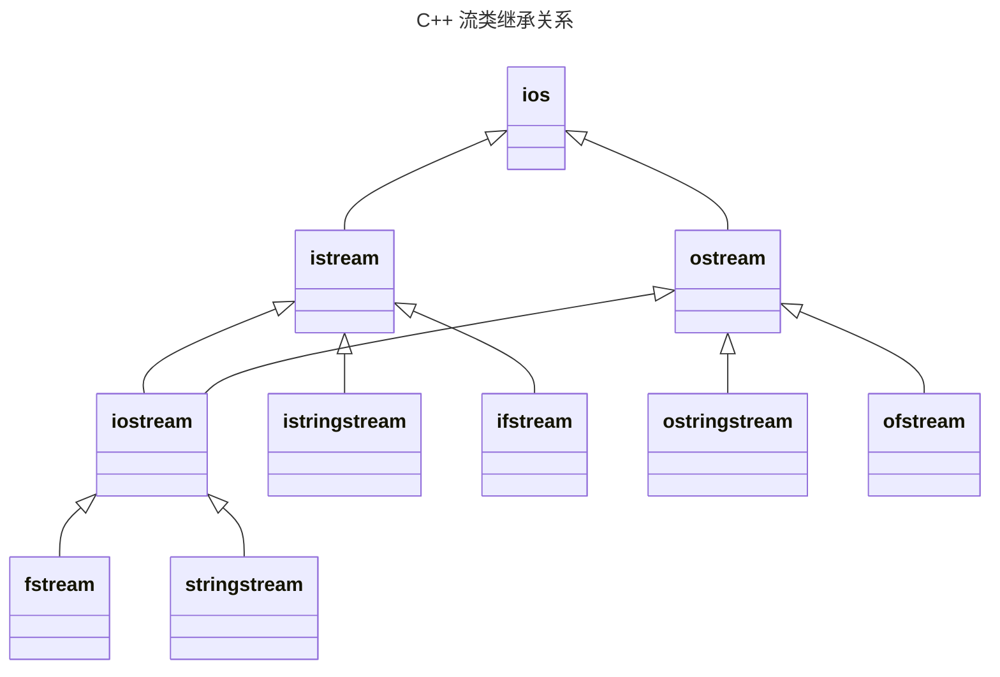

## 一、输入输出与流

输入输出是指程序与外部设备交换信息。
C++把输入输出看成是一个数据流：输出流是内存流向外围设备；输入流是外围设备流向内存。在C++中，输入输出不是语言所定义的部分，而是由标准库提供。C++的输入输出分为，基于控制台的I/O（i`ostream`库）,基于文件的I/O（`fstream`库）,基于字符串的I/O（`ostream`库）

**流的概念及用途**：
 I/O操作是以对数据类型敏感的方式执行的。C++的I/O操作是以字节流的形式实现的。流实际上就是字节序列。C++提供了低级和高级I/O功能。低级I/O功能通常只在设备和内存之间传输一些字节。高级I/O功能把若干个字节组合成有意义的单位，如整数、浮点数、字符、字符串以及用户自定义类型的数据。 C++提供了无格式I/O和格式化I/O两种操作。无格式I/O传输速度快，但使用起来较为麻烦。格式化I/O按不同的类型对数据进行处理，但需要增加额外的处理时间，不适于处理大容量的数据传输。

**流与标准库：**
```
头文件iostream
	istream从流中读取
	ostream写到流中去
	iostream对流进行读写，从istream和ostream派生
头文件:fstream
	ifstream从文件中读取，由istream派生而来
	ofstream写到文件中去，由ostream派生而来
	fstream对流进行读写，由iostream派生而来
头文件：sstream
	istringstream从string对象中读取，由istream派生而来
	ostringstream写到string对象中去，由ostream派生而来
	stringstream对string对象进行读写，由iostream派生而来
```



**输入输出缓冲**：
C++的输入输出是基于缓冲实现的。每个I/O对象管理一个缓冲区，用于存储程序读写的数据。当用户在键盘上输入数据时，键盘输入的数据存储在输入缓冲区中。 当执行">>"操作时，从输入缓冲区中取数据存入变量。如果缓冲区中无数据，则等待从外围设备取数据放入缓冲区。当执行"<<"操作时，将数据放入输出缓冲区。如有下列语句：
```cpp
os << "please enter the value:"; //此处os为输出流对象
```
 系统将字符串常量存储在与输出流os关联的缓冲区中。

**输出缓冲区的刷新**:
取出缓冲区的内容后再将其清空的操作称为缓冲区的刷新。
例如，刷新cout的缓冲区时，从其中取出的内容将显示在控制台上。程序正常结束时，作为main函数返回工作的一部分，会刷新缓冲区。 当缓冲区已满时，在放入下一个值之前，会刷新缓冲区。 用标准库的操纵符（如行结束符endl）可显式地刷新缓冲区。这是 endl 和 '\n' 的又一个区别。 可将输出流与输入流关联起来。在这种情况下，在读输入流时，将刷新其关联的输出缓冲区。在标准库中，cout和cin被关联在一起，因此每个使用cin的输入操作都将刷新cout关联的缓冲区。

**输入输出运算的本质:**
执行输入运算，如`cin >> x`，不一定要此时在外部设备输入。它表示数据从输入缓冲区转移到某个变量的内存空间。当输入缓冲区中没有数据时，输入运算会等待新数据出现后再继续。执行输出运算，如 `cout << x` ，不会立刻输出到外部设备上。它表示数据从某个变量或常量的内存空间复制到输出缓冲区。当输出缓冲区刷新时，输出缓冲区中的数据转移到外部设备。