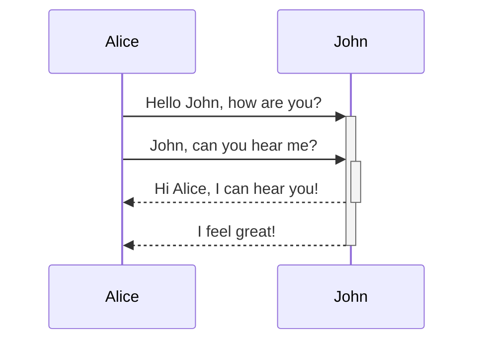
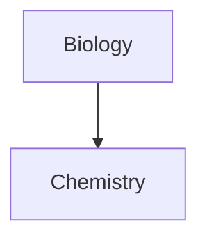

# Sharpen your thinking.

**Obsidian** is the private and flexible writing app that adapts to the way you think.

**obsidian help** [obsidian help](https://help.obsidian.md)

>Human beings face ever more complex and urgent problems, and their effectiveness in
>dealing with these problems is a matter that is critical to the stability and continued progress
>of society.

\- Doug Engelbart, 1961

| First name | Last name |
| ---------- | --------- |
| Max        | Planck    |
| Marie      | Curie     |
First name | Last name
-- | --
Max | Planck
Marie | Curie

| Left-aligned text | Center-aligned text | Right-aligned text |
| :---------------- | :-----------------: | -----------------: |
| Content           |       Content       |            Content |
Left-aligned text | Center-aligned text | Right-aligned text
:-- | :--: | --:
Content | Content | Content

| First column                                 | Second column           |
| -------------------------------------------- | ----------------------- |
| [[Basic formatting syntax\|Markdown syntax]] | ![[Engelbart.jpg\|200]] |
别称的使用和图像的调整

$$
\begin{vmatrix}a & b\\
c & d
\end{vmatrix}=ad-bc
$$
This is an inline math expression $e^{2i\pi} = 1$.

---
tags:
  - recipe
  - cooking
---

#meeting

#inbox/processing

> [!info] Here's a callout title
> Here's a callout block.
> It supports **Markdown**, [[Internal link|Wikilinks]], and [[Embed files|embeds]]!
> ![[Engelbart.jpg]]

>[!warning] 
>here's a callout title
>here's a callout block.
